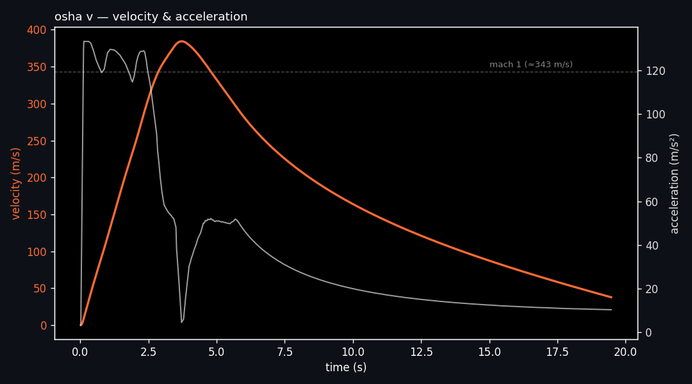
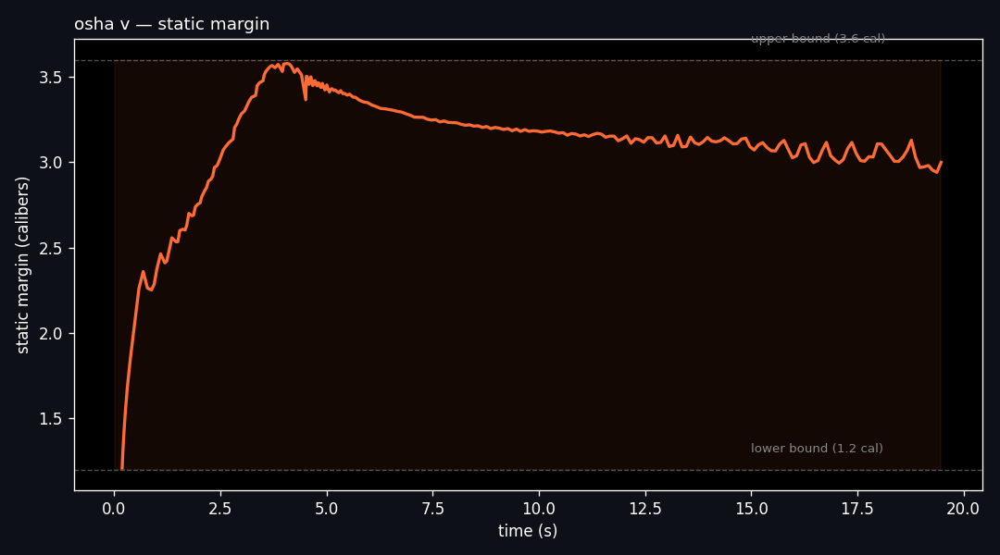
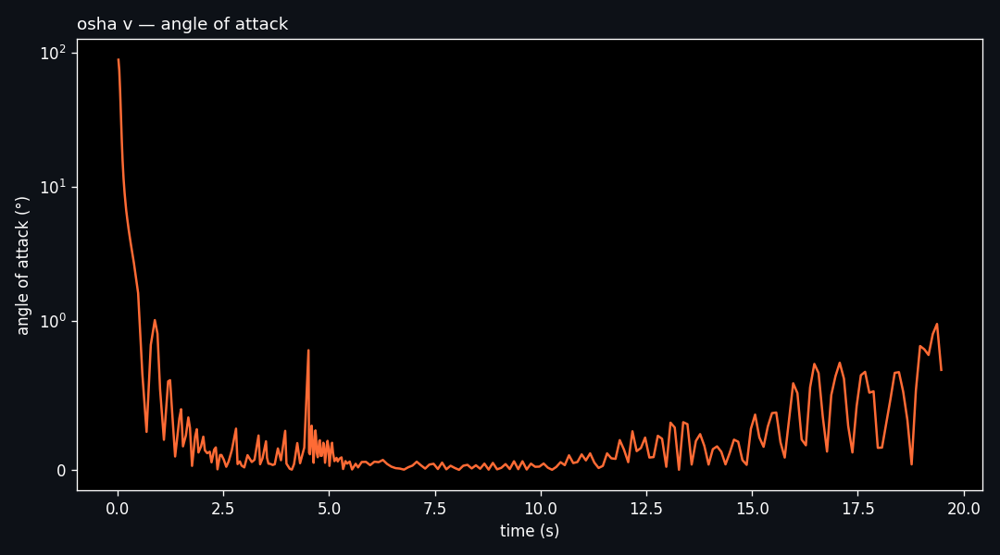
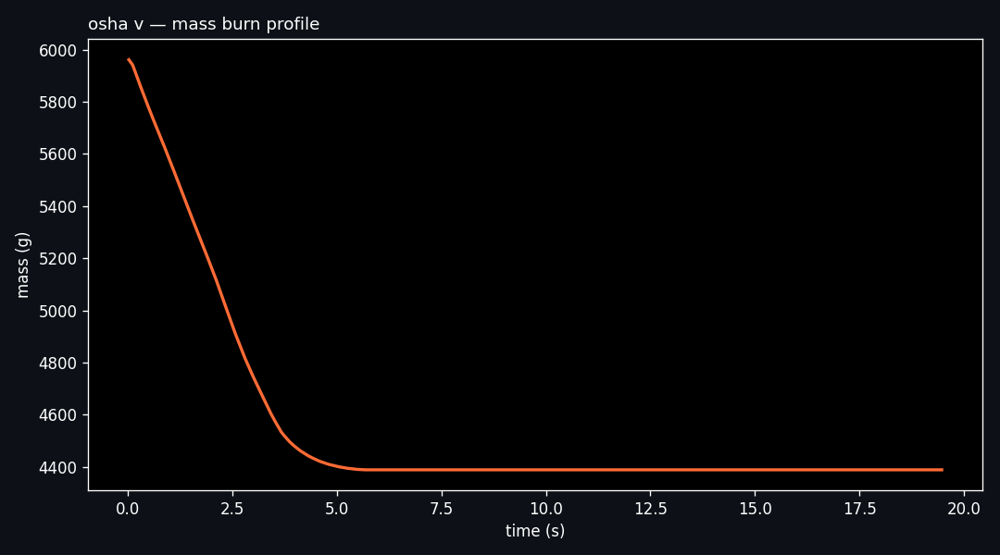

# osha v

transonic sounding rocket, von braun 2024. sim + damping data from the boost-through-coast phase (0 → 19.5 s).

peak velocity **384 m/s** (mach ~1.13), peak accel **~13.6 g**, propellant burn **1.57 kg**. static margin held between **1.21 and 3.58 calibers** the whole flight — stable without over-stabilizing, which was the design target.

## the data

`damping_data.csv` — 261 rows at 0.02 s resolution, exported from openrocket. covers boost through burnout into early coast. no descent, no apogee — this file is scoped to the phase where stability and damping matter.

column groups:
- **kinematics** — time, total velocity, total acceleration
- **stability** — cp/cg locations (cm and m), static margin, angle of attack, reference area
- **aero coefficients** — corrective moment, c2r (aero + total), c2, dr (damping ratio), normal force coefficient
- **mass/propulsion** — mass, mass flow rate, exhaust/tail velocity
- **atmosphere** — air temperature, air pressure
- **geometry** — longitudinal moment of inertia

248 of the 261 rows have populated damping coefficients (post-liftoff). rows 0.02 → 0.18 s show `Rest` in the damping columns — pre-liftoff, on-rail, damping not yet meaningful.

## things worth knowing before loading

- header row has empty columns between named ones (openrocket export artifact)
- mass column is quoted with comma thousands separators (`"5,961.14"`)
- pre-liftoff rows contain the string `Rest` where numeric columns are expected
- trailing rows are empty except for time
- two columns are prefixed with `#` (time, angle of attack) — not a comment marker, just how the export named them

pandas one-liner that handles all of it:

```python
import pandas as pd, numpy as np
df = (pd.read_csv('damping_data.csv')
        .dropna(subset=['# Time (s)'])
        .replace('Rest', np.nan))
# strip commas from mass, cast object columns
for c in df.select_dtypes('object').columns:
    df[c] = df[c].str.replace(',', '').astype(float)
```

## plots

velocity + acceleration through the flight envelope:



static margin stays in the design window (1.2–3.6 cal) across the entire boost phase:



angle of attack — log scale because the on-rail values dwarf the flight values:



mass burn profile:



## notes

- body diameter (9.25 cm) back-calculated from reference area, not read directly from the file
- mach number quoted against a 343 m/s reference (sea level, 15°C). actual local speed of sound varies with the air-temp column if you want to compute a true mach profile
- damping data was validated against openrocket's own stability output; the 4-dof simulator (separate repo, not this one) consumed these coefficients for trajectory reconstruction
